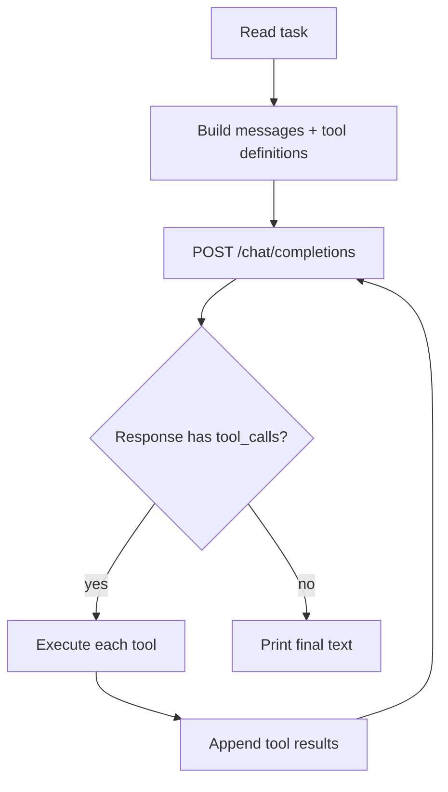

# igor

A minimal, dependency-free coding agent written in **C**. Primary target is
**Win32 (ReactOS)**, but the same source builds and runs on Linux too.

The agent drives an LLM in a loop, runs shell commands via the native process
API (`_popen`/`CreateProcess` on Windows), and lets the model read and write
files — so it can compile and iterate on code with `gcc`/`mingw32` on ReactOS.

## Design

No external libraries to build or vendor:

| Need          | Implementation                                   |
| ------------- | ------------------------------------------------ |
| HTTP + HTTPS  | WinHTTP (`winhttp.dll`) on Win32, OpenSSL on Linux |
| JSON          | tiny self-written parser in `src/json.c`          |
| Process spawn | `_popen` (wraps `CreateProcess`) / `popen`         |
| File I/O      | stdio (`fopen`/`fread`/`fwrite`)                   |

## Requirements

- A C11 compiler. Native: `gcc` + OpenSSL dev headers.
- Cross-compile to Win32: `i686-w64-mingw32-gcc` (or `x86_64-w64-mingw32-gcc`).
- `xorriso` (only for the ISO packaging script).

## Build

```sh
make            # native build (Linux, uses OpenSSL for HTTPS)
make win32      # 32-bit Win32 .exe (uses WinHTTP for HTTPS)
```

The native binary is `igor`; the Win32 binary is `igor.exe`.

## Configuration

Via environment variables (same on every OS):

| Variable       | Default                       | Purpose                              |
| -------------- | ----------------------------- | ------------------------------------ |
| `LLM_API_KEY`  | *(required)*                  | API key for the LLM provider          |
| `LLM_BASE_URL` | `https://api.openai.com/v1`   | Base URL of the OpenAI-compatible API |
| `LLM_MODEL`    | `gpt-4o-mini`                 | Model name                           |
| `LLM_MAX_STEPS`| `8`                           | Max agent loop iterations             |

Defaults can also be baked in at compile time with `make LLM_API_KEY=... LLM_BASE_URL=... LLM_MODEL=...`.

## Usage

```sh
# interactive chat (persistent conversation) when run in a terminal
./igor

# one-shot from a CLI argument
./igor "write a C program that prints hello world, then compile and run it"

# one-shot from stdin
echo "find the bug in main.c and fix it" | ./igor
```

In interactive mode the conversation history is kept across turns. Slash
commands: `/help`, `/clear` (reset history), `/exit` (quit).

### Other OpenAI-compatible providers

Any OpenAI-compatible endpoint works - point it at the API root (no `/v1`):

```sh
export LLM_API_KEY=sk-...
export LLM_BASE_URL=https://api.example.com   # e.g. DeepSeek, Mistral, a local server, ...
export LLM_MODEL=your-model
```

## How it works



## Prep prompt

The binary ships with a built-in system prompt that gives the model its
identity, the list of tools, and operating rules (inspect before guessing,
small focused changes, verify with build/tests, be concise). At runtime it is
prefixed with the OS name and the working directory, so the model gets real
context on every session.

## Project layout

```
igor/
├── Makefile
├── src/
│   ├── main.c        # entry point, env/CLI parsing
│   ├── agent.c       # agent loop, request/response, tool execution
│   ├── http.c        # HTTPS POST (WinHTTP on Win32, OpenSSL on POSIX)
│   └── json.c        # minimal JSON parser + string escaping
└── build_iso.sh      # (gitignored) build + ISO packaging for ReactOS
```

## ReactOS / Win32 notes

- The Win32 build uses WinHTTP, which is built into Windows/ReactOS, and
  `_popen` (which wraps `CreateProcess`) — so it works against any Win32
  command-line tool (`gcc`, `mingw32-gcc`, `make`, ...).
- The binary is statically linked (no libgcc/winpthread DLLs); its only system
  dependency is `winhttp.dll`, present on ReactOS.
