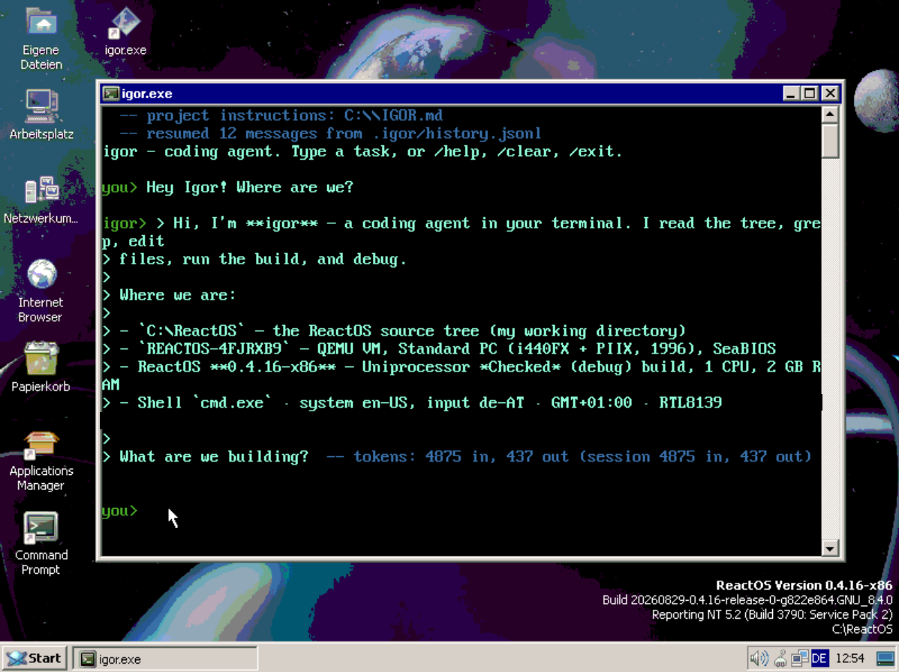
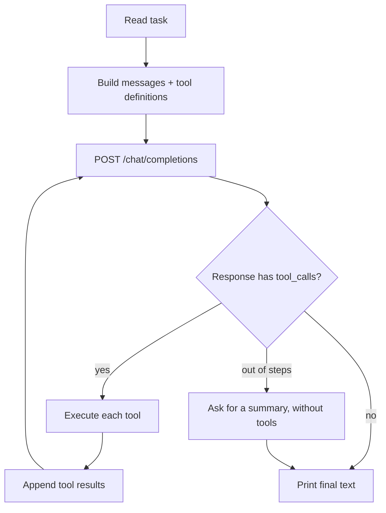

# igor

[](https://github.com/xmeadow/igor/actions/workflows/build.yml)

A small coding agent you talk to in a terminal. You say what you want done;
igor reads your files, runs commands, changes code and tells you what it did.



## Start here

igor is a single program with nothing to install and no runtime to set up. What
it does need is an account with a language-model provider - OpenAI, DeepSeek,
Mistral and anything else speaking the same protocol all work - and an API key
from them.

1. **Get it.** Download it from the
   [latest release](https://github.com/xmeadow/igor/releases/latest):
   `igor-win32-i686.exe` for Windows or ReactOS, `igor-linux-x86_64` for Linux.
   There is also a [download page](https://xmeadow.github.io/igor/) that an old
   browser can handle. Or build it yourself - see [Build](#build).
2. **Start it.** The first run asks which provider you use and for your key,
   then remembers both. Nothing to edit, no files to create.
3. **Ask for something.**

```
you> what does main.c do, and is there a bug in it?
```

That is all of it. `igor --help` lists the rest, and the sections below are how
it works and why - worth reading when you want to know, safe to skip when you
do not.

### What it is made of

A dependency-free agent written in **C**. The primary target is **Win32
(ReactOS)**, but the same source builds and runs on Linux too. It drives a
language model in a loop, runs shell commands through the native process API
(`CreateProcess` on Windows, `popen` on Linux) and lets the model read and
write files - so it can compile and iterate on code with `gcc`/`mingw32` on
ReactOS.

## Design

No external libraries to build or vendor:

| Need          | Implementation                                   |
| ------------- | ------------------------------------------------ |
| HTTP + HTTPS  | WinHTTP (`winhttp.dll`) on Win32, OpenSSL on Linux |
| JSON          | tiny self-written parser in `src/json.c`          |
| Process spawn | own `CreateProcess` with a timeout on Win32, `popen` on Linux |
| File I/O      | stdio (`fopen`/`fread`/`fwrite`)                   |

`read_file` takes an optional `offset` and `limit`. Content containing a NUL
byte comes back as a hex dump with absolute offsets, so the model can inspect
bytes on a system that has no `xxd`, `od` or `hexdump`.

## Requirements

- A C11 compiler. Native: `gcc` + OpenSSL dev headers.
- Cross-compile to Win32: `i686-w64-mingw32-gcc` (or `x86_64-w64-mingw32-gcc`).
- `xorriso` (only for the ISO packaging script).

## Build

```sh
make            # native build (Linux, uses OpenSSL for HTTPS)
make win32      # 32-bit Win32 .exe (uses WinHTTP for HTTPS)
```

The native binary is `igor`; the Win32 binary is `igor.exe`.

## First run

igor needs an API key for some language model. Started from a terminal without
one, it asks instead of refusing:

```
igor needs an API key for a language model before it can do
anything. This asks once and remembers the answers.

  1) OpenAI
  2) DeepSeek
  3) Mistral
  4) OpenRouter
  5) A local server (Ollama, llama.cpp, ...)
  6) Something else

Which one [1]:
```

Picking a provider fills in its base URL and a default model, so the usual case
is one keypress and a pasted key. The key is not echoed while it is typed. The
answers are written to a file and the chat starts; the next run reads them and
asks nothing.

`igor --setup` goes through the same questions again, as does `/setup` in an
interactive session - that one takes effect immediately, without a restart.

## Configuration

A setting is looked for in the environment first, then in the file the setup
wrote, then in the built-in default. The environment therefore wins for a single
run without disturbing what was set up once.

The file lives where the platform keeps per-user configuration - not in the
working directory, which is often a repository that would carry the key away:

| Platform | Path |
| --- | --- |
| Linux, ReactOS with a home | `$XDG_CONFIG_HOME/igor/config`, else `~/.config/igor/config` |
| Windows  | `%APPDATA%\igor\config`, else `%USERPROFILE%\.igor\config` |

It is a plain list of `NAME = value` lines using the names below, `#` starts a
comment, and on POSIX it is created readable only by its owner. Any of these
settings can be put there, not just the three the setup asks about:

| Variable       | Default                       | Purpose                              |
| -------------- | ----------------------------- | ------------------------------------ |
| `LLM_API_KEY`  | *(asked for on first run)*    | API key for the LLM provider          |
| `LLM_BASE_URL` | `https://api.openai.com/v1`   | Base URL of the OpenAI-compatible API |
| `LLM_MODEL`    | `gpt-4o-mini`                 | Model name                           |
| `LLM_MAX_STEPS`| `16`                          | Tool-using iterations before the agent is asked to summarise |
| `IGOR_COMMAND_TIMEOUT` | `120`                 | Seconds a shell command may run (Win32) |
| `LLM_STREAM`   | `1`                           | Show the answer while it is being written |
| `IGOR_SHOW_THINKING` | `0`                     | Print the model's reasoning, dimmed, instead of only ticking it in the status line |
| `IGOR_CONTEXT_TOKENS` | `32000`               | Ceiling for one request, in tokens; older turns are dropped to stay under it |
| `IGOR_HISTORY` | `.igor/history.jsonl`         | Where an interactive session is kept; a path, or `off` to keep nothing |

Defaults can also be baked in at compile time with `make LLM_API_KEY=... LLM_BASE_URL=... LLM_MODEL=...`.

## Usage

```sh
# interactive chat (persistent conversation) when run in a terminal
./igor

# one-shot from a CLI argument
./igor "write a C program that prints hello world, then compile and run it"

# one-shot from stdin
echo "find the bug in main.c and fix it" | ./igor

# change the API key, base URL and model
./igor --setup
```

In interactive mode the conversation history is kept across turns and written to
disk, so a restart continues where you left off. Slash commands: `/help`,
`/setup` (change the provider settings), `/clear` (forget the conversation and
remove the file), `/exit` (quit). See [The conversation](#the-conversation).

### Other OpenAI-compatible providers

Any OpenAI-compatible endpoint works - point it at the API root (no `/v1`):

```sh
export LLM_API_KEY=sk-...
export LLM_BASE_URL=https://api.example.com   # e.g. DeepSeek, Mistral, a local server, ...
export LLM_MODEL=your-model
```

## Tools

| Tool | What it does |
| --- | --- |
| `run_command` | run a shell command, return exit status and output |
| `read_file` | read a file or a byte range; content with a NUL byte comes back as a hex dump |
| `write_file` | create or overwrite a file |
| `edit` | replace an exact snippet in a text file, instead of rewriting the whole file |
| `grep` | find a literal string in files, recursively |

No tool may return more than a quarter of `IGOR_CONTEXT_TOKENS`; anything longer
is cut and the cut is reported, so a result is never mistaken for the whole
story. `read_file` and `grep` can be asked for the rest in pieces.

`grep` is implemented in the process rather than shelled out: the target
platform has no `grep`, and its `findstr` has no recursive mode worth using. It
skips hidden directories and binary files and caps its output at 100 matches
(200 characters per line) so one search cannot flood the context.

`edit` replaces the first exact match, or the one named by `occurrence`, or all
of them with `all`. It refuses when the snippet is missing, matches more than
once without being told which, or the file holds binary data — and it reports
the line it changed.

## Telling thought, work and answer apart

Igor writes three kinds of text and they have to stay apart:

| What | Stream | How it looks |
| --- | --- | --- |
| the model's reasoning | stderr | a ticker in the status line: `... thinking 4s <newest words>` |
| what igor is doing | stderr | one line per tool call: `-> <tool>: <target> (0.4s) ok`, cyan |
| the answer | stdout | plain, behind an `igor> ` mark |

Every line of the transcript opens with a marker, so it stays readable without
colour: green `you>` / `igor>` is the conversation, cyan `--` / `->` is igor's
trace, red is a problem. On a console colour is added on top of that - Windows
console attributes, ANSI everywhere else. When the output is redirected there
is neither colour nor marker, so a piped answer stays clean while the trace
keeps its text.

A tool line says how it went: `ok`, or `failed` / `timed out` in red when igor
could not carry the action out. A command that exits non-zero is still an `ok`
call - its exit code is in the result the model reads.

`igor> ` is printed where the answer *starts*, not where the request starts.
Putting it up before the request meant the trace scrolled in underneath the mark
and the answer had nothing in front of it. The mark reappears for every block
the model speaks in between two tool calls, so a long run reads as a transcript
rather than one undivided stream.

Reasoning is hidden by default: written out, it buries the answer. Instead its
newest words appear in the status line, in place, so a pause is not a mystery.
`IGOR_SHOW_THINKING=1` prints it in full - dimmed, and with a `  . ` gutter on
every line so it cannot be mistaken for the answer.

One case cannot be told apart while it happens: a model often talks before it
acts ("I'll search for that"), and in the protocol that text is an ordinary
answer fragment. It is printed plain, and the tool line that follows marks it as
preamble rather than an answer.

## The status line

While a request is in flight igor draws one line on stderr - `... waiting for
the model`, `... thinking 3s <words>`, `... running edit` - and overwrites it in
place, so the screen says what is happening without filling up with it. It is
drawn only on a terminal: redirected, it would be noise in a log. Nothing is
written into the line while it is up; output clears it first.

## Streaming

The answer is requested with `stream: true` and printed as it arrives, so a
long answer does not look like a hang. `LLM_STREAM=0` turns that off. If a
server ignores `stream` and answers with a plain JSON document, igor notices and
reads it the ordinary way.

## The conversation

An interactive session is kept in `.igor/history.jsonl` - beside the project's
skills - so `/exit` or a crash does not throw the chat away. The next start says
what it found:

```
  -- resumed 6 messages from .igor/history.jsonl
```

`IGOR_HISTORY` names a different file (to keep several conversations apart, or
to give a scripted run a memory) and takes `off`, `none`, `-` or `0` to keep
nothing. A one-shot task keeps nothing unless `IGOR_HISTORY` says otherwise,
because it has nothing to come back to.

Only what the model needs to carry on is written: the user's messages and the
assistant's text. Tool calls and their output are left out on purpose - they are
the bulk of a long session, worth little the next day, and every one of them
would be paid for again on every request. Each turn is one record, so the file
reads like a transcript.

### Staying inside the window

Every request carries the whole conversation, so a session that never forgets
gets slower and dearer on every step and finally hits the model's window.
`IGOR_CONTEXT_TOKENS` (default 32000) is the ceiling for one request. Above it,
igor drops the oldest turns - whole turns at a time, so a tool call never loses
the result it belongs to - until the rest fits. The system message and the
newest turn always stay. A drop is reported rather than silent:

```
  -- 4 older messages dropped to stay under 32000 tokens
```

There is no tokenizer here. The count starts from a rough three-characters-per-
token estimate and is corrected against the `usage` the API reports with every
answer, so the budget keeps meaning tokens whatever the text is made of. For a
model with a bigger window, `IGOR_CONTEXT_TOKENS` is the one knob to turn.

What no budget can fix by dropping turns: a message that is too big on its own.
It is the newest, so there is nothing older to drop, and the prompt that is
mostly preprompt and tool definitions has nothing droppable at all. So the tools
are bounded as well: no single result may take more than a quarter of the
budget. `read_file` reads a range of that size unless told otherwise and says
which bytes came back, so fetching the rest is a follow-up call. A result that
another tool produces and that is longer gets cut, with a line saying so - a
silent cut would be worse than no result, because a prefix reads exactly like
the whole thing.

Command output is bounded the same way, at 1 MiB, but the command is left to
run to the end: the exit code stays real and only what is kept is limited. What
was cut is reported either way.

### What a request cost

When the server reports it, every step says what it was billed. These numbers
are the API's, not an estimate:

```
  -- tokens: 1704 in, 2 out (session 4820 in, 117 out)
```

A streaming answer needs `stream_options.include_usage` for that. A server that
does not know the field is retried once without it, rather than leaving you with
a client that breaks on a working endpoint.

## How it works



The step limit bounds tool-using iterations, not the answer: when it is used up
the agent gets one more request with the tools left out, so a run always ends
with text. That request is not kept in the conversation history — only the
summary is.

## Prep prompt

The binary ships with a built-in system prompt that gives the model its
identity, the list of tools, and operating rules (inspect before guessing,
small focused changes, verify with build/tests, be concise). At runtime it is
prefixed with the OS name, the shell (on Windows `cmd.exe`, explicitly not
PowerShell), the working directory and the system directory, so the model gets
real context on every session.

### Project instructions

If the working directory (or one of its parents, up to eight levels) holds an
`AGENTS.md`, its contents are appended to the system message. `IGOR.md` and
`CLAUDE.md` are accepted as aliases. The closest file wins; it is capped at
8 KiB and truncated with a note if longer. A repository can therefore state its
conventions once instead of repeating them in every prompt:

```markdown
- Build with `make` and `make win32`.
- The demo API key lives in build_iso.sh and deploy.sh, both gitignored.
```

The path that was loaded is reported on stderr when a session starts.

**Trust boundary.** This text is instruction from the repository and it becomes
part of the system prompt. Cloning a repository therefore also brings its
instructions to your agent. Read an `AGENTS.md` you did not write before you run
igor next to it.

### Skills

A skill is a directory holding a `SKILL.md`: a description of when it applies,
and a body with the instructions.

```
.igor/skills/pdf-forms/SKILL.md
```

```markdown
---
name: pdf-forms
description: Fill in PDF forms from a CSV. Use when the task involves a PDF form.
---

1. Read the CSV and ...
```

The names and descriptions go into the system message; the model reads a body
with `read_file` when the description fits the task, and follows it. That is what
makes this cheap: a skill costs one line until it is needed.

Looked up in `.igor/skills` and `.agents/skills`, in the working directory or up
to eight parents, closest first. At most 32 skills, descriptions cut at 200
characters, and the frontmatter is parsed loosely - without it, the first
non-empty line serves as the description.

The trust warning above applies here too: a skill is instruction from the
repository.

## Project layout

```
igor/
├── Makefile
├── src/
│   ├── main.c        # entry point, CLI parsing, first-run setup, console I/O
│   ├── agent.c       # agent loop, request/response, tool execution
│   ├── http.c        # HTTPS POST (WinHTTP on Win32, OpenSSL on POSIX)
│   ├── json.c        # minimal JSON parser + string escaping
│   └── config.c      # the saved settings file
└── build_iso.sh      # (gitignored) build + ISO packaging + deploy
└── deploy.sh         # (gitignored) build + copy onto the target machine
```

## ReactOS / Win32 notes

- The Win32 build uses WinHTTP, which is built into Windows/ReactOS, and its own
  `CreateProcess` wrapper — so it works against any Win32 command-line tool
  (`gcc`, `mingw32-gcc`, `make`, ...).
- The binary is statically linked (no libgcc/winpthread DLLs); its only system
  dependency is `winhttp.dll`, present on ReactOS.

ReactOS deviates from Windows in ways that used to break the agent, so the
Win32 code works around them:

- **Request body in 4 KB pieces.** A single large socket write right after the
  TLS handshake exceeds the peer's usable window; ReactOS' winhttp asserts in
  `dll/win32/winhttp/net.c` (`sock_send`) and aborts the process.
- **Tool output is repaired to UTF-8.** `cmd.exe` writes its own messages in the
  OEM code page, mixed with UTF-8 from the tools it runs. Valid sequences pass
  through, stray bytes are re-encoded — otherwise the API rejects the request
  with `invalid unicode code point`.
- **Command arguments are read as UTF-8 when they are well-formed** and as the
  ANSI code page otherwise, so both `cmd.exe` typing and an ssh client work.
- **Commands time out after 120 s** (override with `IGOR_COMMAND_TIMEOUT`) and are
  killed. `_popen` cannot be interrupted, and a hanging script blocked the agent
  and held `igor.exe`.
- **Killing a command takes its process tree.** Windows gets a job object;
  ReactOS returns `ERROR_INVALID_FUNCTION` from `AssignProcessToJobObject`, so
  there the tree is walked with Toolhelp and terminated by hand.
- **`PATH` is fixed for tool calls.** ReactOS ships a `PATH` pointing at a
  non-existent `C:\Windows`, so no system tool is reachable by bare name; igor
  prepends `%SystemRoot%\system32;%SystemRoot%`.

## License

[MIT](LICENSE)
