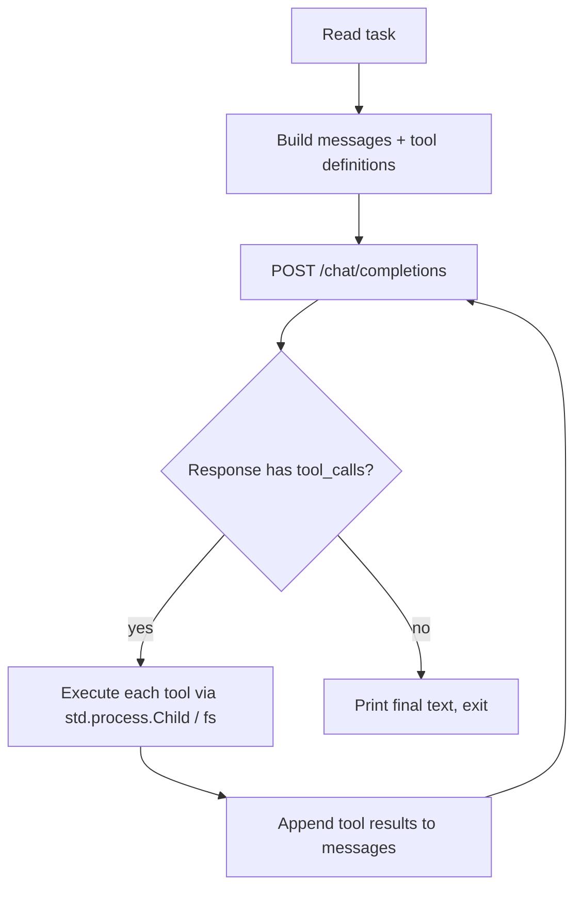

# igor

A minimal, dependency-free coding agent written in [Zig](https://ziglang.org/).

Primary target is **Win32 (ReactOS)**, but because Zig's standard library is
cross-platform, the exact same binary source builds and runs on Linux, macOS,
and Windows. The agent drives an LLM in a loop, executes shell commands via the
native process API (`CreateProcessW` on Windows), and lets the model read and
write files — so it can compile and iterate on code with `gcc`/`mingw32` on
ReactOS.

## Design

The whole point is *no external dependencies*. Everything the original
C-centric plan would have pulled in from libcurl, cJSON and `popen()` is
already in Zig's standard library:

| Need (C world)          | Zig equivalent                                    | Notes |
| ----------------------- | ------------------------------------------------- | ----- |
| libcurl (Win32)         | `std.http.Client` + `std.crypto.tls`              | HTTPS + TLS, no libcurl |
| cJSON                   | `std.json`                                        | parse **and** stringify, no cJSON |
| `CreateProcess`/`popen` | `std.process.Child`                               | wraps `CreateProcessW` on Windows, `fork`/`exec` on POSIX |
| `gcc`/`mingw32` control | same `std.process.Child` as above                 | one mechanism for every subprocess |

Because Zig ships its own libc, compiler-rt and mingw-w64 headers, cross-compiling
to Win32 works with a single flag — no mingw-w64 toolchain, no libcurl dev
packages, no vendored C sources.

## Features

- Agentic loop: send a task → LLM returns either text or tool calls → tools run
  → results are fed back → repeat until the model finishes.
- Tools:
  - `run_command` — run a shell command, capture `exit_code`, `stdout`, `stderr`
    (`cmd.exe` on Windows, `/bin/sh` on POSIX).
  - `read_file` — read a file as UTF-8 text.
  - `write_file` — create/overwrite a file.
- OpenAI-compatible `chat/completions` endpoint (works with OpenAI and most
  self-hosted/compatible servers). Anthropic works through any
  OpenAI-compatible gateway.
- Cross-compiles to `x86-windows` (32-bit) and `x86_64-windows` (64-bit).

## Requirements

- Zig `0.16` (or newer; the std API is verified against the installed version).

No other build dependencies.

## Build

```sh
# native build (whatever OS you are on)
zig build

# release build
zig build -Doptimize=ReleaseSafe
```

The binary is `zig-out/bin/igor` by default.

### Cross-compile for ReactOS / Win32

```sh
# 64-bit Win32
zig build -Dtarget=x86_64-windows-gnu -Dcpu=baseline

# 32-bit Win32 (classic ReactOS)
zig build -Dtarget=x86-windows-gnu -Dcpu=baseline
```

`-Dcpu=baseline` keeps the binary friendly to older/odd CPUs, which is usually
what you want on ReactOS. The result is a plain PE `.exe` that can be copied
onto a ReactOS/Windows machine.

## Configuration

All configuration is via environment variables (works the same on every OS):

| Variable         | Default                       | Purpose                              |
| ---------------- | ----------------------------- | ------------------------------------ |
| `LLM_API_KEY`    | *(required)*                  | API key for the LLM provider          |
| `LLM_BASE_URL`   | `https://api.openai.com/v1`   | Base URL of the OpenAI-compatible API |
| `LLM_MODEL`      | `gpt-4o-mini`                 | Model name                           |
| `LLM_MAX_STEPS`  | `8`                           | Max agent loop iterations             |

## Usage

```sh
# from a CLI argument
igor "write a C program that prints hello world, then compile and run it"

# or from stdin
echo "find the bug in src/main.c and fix it" | igor
```

## How it works



## Project layout

```
igor/
├── build.zig          # build script (native + cross-compile targets)
├── build.zig.zon      # package manifest (no dependencies)
├── src/
│   ├── main.zig       # entry point, env/CLI parsing, agent loop
│   ├── llm.zig        # OpenAI-compatible chat completions client (std.http + std.json)
│   └── tools.zig      # run_command / read_file / write_file
└── README.md
```

## ReactOS / Win32 notes

- **Process spawning**: `std.process.Child` uses `CreateProcessW` on Windows, so
  it works against any Win32 command-line tool (`gcc`, `mingw32-gcc`, `make`,
  etc.) exactly as requested.
- **TLS / CA bundle**: HTTPS uses Zig's TLS implementation and loads root
  certificates from the platform store on first use (system store on Linux,
  Windows cert store on Win32). ReactOS cert-store coverage is something to
  verify; if validation fails there, the fallback is to bundle a PEM CA file.
- **Console I/O**: the agent prints UTF-8; on Win32 it writes to stdout/stderr
  as byte streams (no wide-char API needed for a simple CLI agent).

## Status

WIP. Implemented against Zig `0.16`; the std-library API (`std.http.Client`,
`std.json`, `std.process.Child`) is verified against the installed version
before writing code. Building and an end-to-end run on Linux are the primary
smoke test; Win32 cross-compilation is the ReactOS path.
