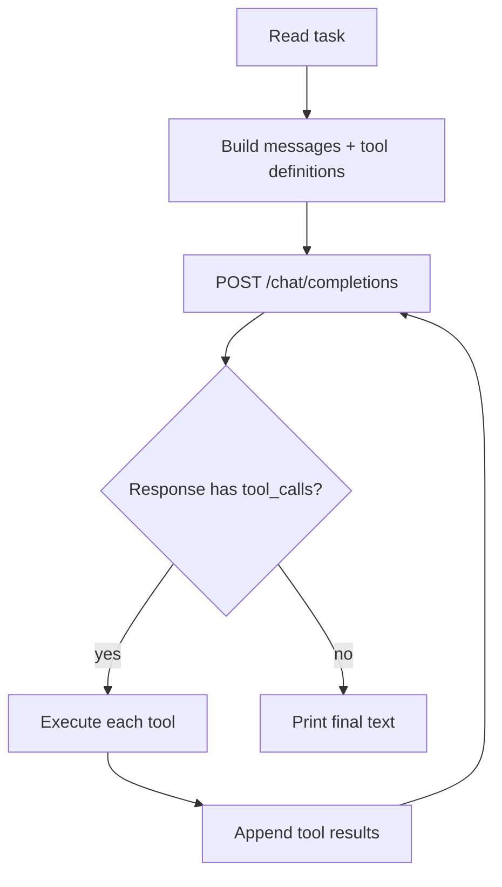

# igor

A minimal, dependency-free coding agent written in **C**. Primary target is
**Win32 (ReactOS)**, but the same source builds and runs on Linux too.

The agent drives an LLM in a loop, runs shell commands through the native
process API (`CreateProcess` on Windows, `popen` on Linux), and lets the model
read and write files — so it can compile and iterate on code with
`gcc`/`mingw32` on ReactOS.

## Design

No external libraries to build or vendor:

| Need          | Implementation                                   |
| ------------- | ------------------------------------------------ |
| HTTP + HTTPS  | WinHTTP (`winhttp.dll`) on Win32, OpenSSL on Linux |
| JSON          | tiny self-written parser in `src/json.c`          |
| Process spawn | own `CreateProcess` with a timeout on Win32, `popen` on Linux |
| File I/O      | stdio (`fopen`/`fread`/`fwrite`)                   |

`read_file` takes an optional `offset` and `limit`. Content containing a NUL
byte comes back as a hex dump with absolute offsets, so the model can inspect
bytes on a system that has no `xxd`, `od` or `hexdump`.

## Requirements

- A C11 compiler. Native: `gcc` + OpenSSL dev headers.
- Cross-compile to Win32: `i686-w64-mingw32-gcc` (or `x86_64-w64-mingw32-gcc`).
- `xorriso` (only for the ISO packaging script).

## Build

```sh
make            # native build (Linux, uses OpenSSL for HTTPS)
make win32      # 32-bit Win32 .exe (uses WinHTTP for HTTPS)
```

The native binary is `igor`; the Win32 binary is `igor.exe`.

## Configuration

Via environment variables (same on every OS):

| Variable       | Default                       | Purpose                              |
| -------------- | ----------------------------- | ------------------------------------ |
| `LLM_API_KEY`  | *(required)*                  | API key for the LLM provider          |
| `LLM_BASE_URL` | `https://api.openai.com/v1`   | Base URL of the OpenAI-compatible API |
| `LLM_MODEL`    | `gpt-4o-mini`                 | Model name                           |
| `LLM_MAX_STEPS`| `16`                          | Max agent loop iterations             |
| `IGOR_COMMAND_TIMEOUT` | `120`                 | Seconds a shell command may run (Win32) |

Defaults can also be baked in at compile time with `make LLM_API_KEY=... LLM_BASE_URL=... LLM_MODEL=...`.

## Usage

```sh
# interactive chat (persistent conversation) when run in a terminal
./igor

# one-shot from a CLI argument
./igor "write a C program that prints hello world, then compile and run it"

# one-shot from stdin
echo "find the bug in main.c and fix it" | ./igor
```

In interactive mode the conversation history is kept across turns. Slash
commands: `/help`, `/clear` (reset history), `/exit` (quit).

### Other OpenAI-compatible providers

Any OpenAI-compatible endpoint works - point it at the API root (no `/v1`):

```sh
export LLM_API_KEY=sk-...
export LLM_BASE_URL=https://api.example.com   # e.g. DeepSeek, Mistral, a local server, ...
export LLM_MODEL=your-model
```

## How it works



## Prep prompt

The binary ships with a built-in system prompt that gives the model its
identity, the list of tools, and operating rules (inspect before guessing,
small focused changes, verify with build/tests, be concise). At runtime it is
prefixed with the OS name, the shell (on Windows `cmd.exe`, explicitly not
PowerShell), the working directory and the system directory, so the model gets
real context on every session.

## Project layout

```
igor/
├── Makefile
├── src/
│   ├── main.c        # entry point, env/CLI parsing
│   ├── agent.c       # agent loop, request/response, tool execution
│   ├── http.c        # HTTPS POST (WinHTTP on Win32, OpenSSL on POSIX)
│   └── json.c        # minimal JSON parser + string escaping
└── build_iso.sh      # (gitignored) build + ISO packaging + deploy
└── deploy.sh         # (gitignored) build + copy onto the target machine
```

## ReactOS / Win32 notes

- The Win32 build uses WinHTTP, which is built into Windows/ReactOS, and its own
  `CreateProcess` wrapper — so it works against any Win32 command-line tool
  (`gcc`, `mingw32-gcc`, `make`, ...).
- The binary is statically linked (no libgcc/winpthread DLLs); its only system
  dependency is `winhttp.dll`, present on ReactOS.

ReactOS deviates from Windows in ways that used to break the agent, so the
Win32 code works around them:

- **Request body in 4 KB pieces.** A single large socket write right after the
  TLS handshake exceeds the peer's usable window; ReactOS' winhttp asserts in
  `dll/win32/winhttp/net.c` (`sock_send`) and aborts the process.
- **Tool output is repaired to UTF-8.** `cmd.exe` writes its own messages in the
  OEM code page, mixed with UTF-8 from the tools it runs. Valid sequences pass
  through, stray bytes are re-encoded — otherwise the API rejects the request
  with `invalid unicode code point`.
- **Command arguments are read as UTF-8 when they are well-formed** and as the
  ANSI code page otherwise, so both `cmd.exe` typing and an ssh client work.
- **Commands time out after 120 s** (override with `IGOR_COMMAND_TIMEOUT`) and are
  killed. `_popen` cannot be interrupted, and a hanging script blocked the agent
  and held `igor.exe`.
- **Killing a command takes its process tree.** Windows gets a job object;
  ReactOS returns `ERROR_INVALID_FUNCTION` from `AssignProcessToJobObject`, so
  there the tree is walked with Toolhelp and terminated by hand.
- **`PATH` is fixed for tool calls.** ReactOS ships a `PATH` pointing at a
  non-existent `C:\Windows`, so no system tool is reachable by bare name; igor
  prepends `%SystemRoot%\system32;%SystemRoot%`.
